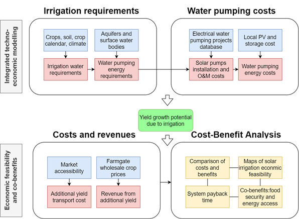

Main code for the paper "Solar irrigation in sub-Saharan Africa: economic feasibility and development potential" (2023), by Giacomo Falchetta, Francesco Semeria, Marta Tuninetti, Vittorio Giordano, Shonali Pachauri, and Edward Byers, Environmental Research Letters, https://iopscience.iop.org/article/10.1088/1748-9326/acefe5

Replication data folder: https://drive.google.com/drive/folders/16TPUJBAuSOsEO4kVB2QjMqvIEfzKaI2U?usp=sharing

To operate the analysis:
- Download and extract the replication data folder
- Clone this code repository
- Open the wrapper.R file
- Edit the path to the input_data folder, as well as your email address and the working directory
- Define the scenarios you want to run in the preamble of the wrapper.R file
- Run the script
- The results will be stored in your working directory

