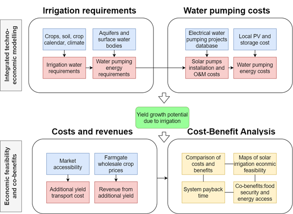

## Main code for the paper "Solar irrigation in sub-Saharan Africa: economic feasibility and development potential", by Giacomo Falchetta, Francesco Semeria, Marta Tuninetti, Vittorio Giordano, Shonali Pachauri, and Edward Byers

